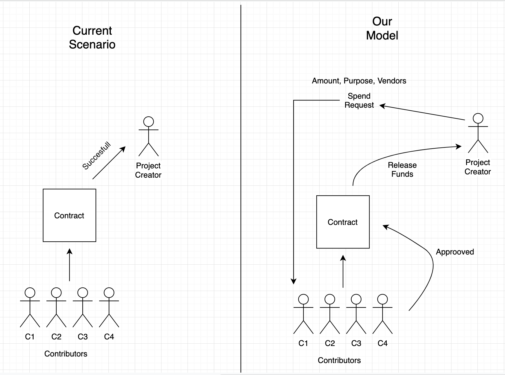

# Conserve-a-BIT

## Project:

A crowdfunding platform for non-profits, government organisations and startups to raise donations.

## Features:

* Decentralised and Transparent
* No third-party charges
* Contributors have the authority to release funds from the contract
* Track fraudlent scammers
* Amount of their donation that’s been reinvested
* The projects they want to re-invest in from their revolving funds

## Installing:

`npm install --save`
### Compile and Deploy Contract

-----------
In ethereum directory: 

`node compile.js`

`node deploy.js`

* Copy the contract ID obtained on terminal
* Paste it to generator.js

-----------
In root directory:

`node server`

## Tech-Stack:

 * [*Solidity*](https://github.com/ethereum/solidity) 
 * [*Node js*](https://nodejs.org)
 * [*React*](https://reactjs.org/)
 * [*Infura*](https://infura.io/)
 * [*MongoDB*](https://www.mongodb.com/)
 
 

## Members:
1. [Adnan Azmat](https://github.com/adnan-azmat)
2. [Saurav Kumar Singh](https://github.com/saurav3199)
3. [Aman Toppo](https://github.com/amntoppo)
4. [Kanjal Dalal](https://github.com/LoneWolfKJ)
